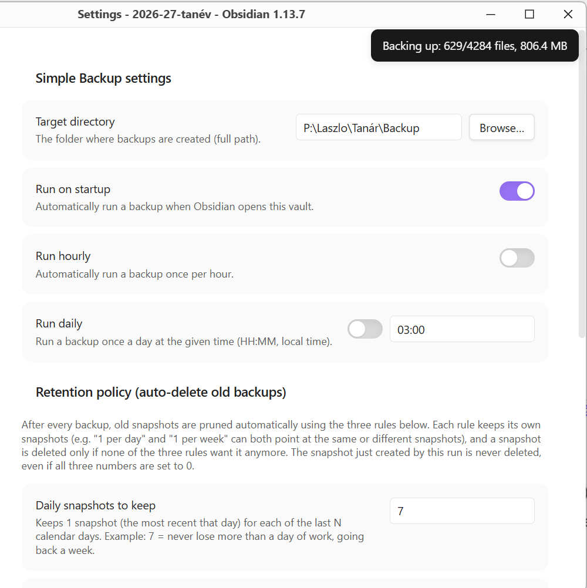

# Simple Backup

A minimal Obsidian plugin with a single job: copy your entire vault to a folder of your choice, timestamped and versioned, without ever slowing down Obsidian.

## Why

Most sync/backup plugins are built around cloud services, conflict resolution, or partial sync. Simple Backup does none of that — it just makes a plain, timestamped copy of the vault on a schedule (or on demand), and prunes old copies according to a retention policy you control. If you already sync your vault another way and just want a local (or network-drive) safety net, this is it.

## How it works

- On each run, Simple Backup copies the vault using fully asynchronous file operations (Node's `fs.promises`), so the actual disk I/O runs on a background thread pool instead of Obsidian's UI thread — the interface never freezes or stutters during a backup, even a large one.
- The vault is copied into `<target>/<vault-name>-<YYYY-MM-DD-HHmm>/`.
- Common junk/VCS folders (`node_modules`, `.git`, `.trash`, OS metadata files, etc.) are excluded by default and configurable.
- After every backup, a **retention policy** (keep N daily / N weekly / N monthly snapshots) prunes old backups automatically. The snapshot that was just created is always kept.
- Only **errors** are logged, to `backup-errors.log` inside the plugin's own folder — there is no verbose success log to sift through.

## Features

- **Manual trigger**: ribbon icon and a command palette entry ("Run backup now").
- **Scheduled triggers** (each independently toggleable):
  - On Obsidian startup
  - Hourly
  - Daily, at a configurable time
- **Live progress notice**: a small, single, continuously-updating notification shows roughly how far the current backup has gotten (files copied, size so far).
- **Retention/rotation**: configurable number of daily/weekly/monthly snapshots to keep; everything else gets deleted automatically at the end of each run.
- **Folder picker**: a native "Browse…" button next to the target directory field (uses Electron's dialog on desktop).
- **Configurable exclude list** for files/folders that shouldn't be copied.

## Settings

| Setting | Description |
|---|---|
| Target directory | Absolute path of the folder where dated backup snapshots are created. Required. |
| Run on startup | Trigger a backup automatically whenever Obsidian opens the vault. |
| Run hourly | Trigger a backup once per hour. |
| Run daily | Trigger a backup once a day at a set `HH:MM` (local time). |
| Keep daily / weekly / monthly | How many most-recent daily/weekly/monthly snapshots to retain. |
| Excluded files/folders | Comma-separated list of names to skip while copying (matched by exact name, not path). |

## Requirements

- Desktop only (Windows/macOS/Linux). The plugin relies on Node.js's `fs` module and (optionally) Electron's native dialog, neither of which is available in Obsidian Mobile — the plugin is marked `isDesktopOnly` and won't load on iOS/Android.

## Installation (manual)

1. Copy `manifest.json` and `main.js` into `<your-vault>/.obsidian/plugins/simple-backup/`.
2. Reload Obsidian (or toggle the plugin off/on) and enable **Simple Backup** under `Settings → Community plugins`.
3. Open the plugin's settings and set a target directory before running your first backup.

## Known limitations

- **No separate OS process.** An earlier version of this plugin ran the copy in a spawned child process at a lowered OS scheduling priority. In practice, Obsidian's Electron build silently ignores the standard mechanism for turning its own executable into a plain Node process (`ELECTRON_RUN_AS_NODE`), so the spawned "child" never actually ran the worker script — it just exited immediately. Rather than depend on that, the backup now runs inside Obsidian's own process using fully asynchronous I/O, which keeps the UI responsive without needing a second process at all. The trade-off is that the copy no longer gets a lowered OS priority of its own — in practice this is a non-issue, since copying is I/O-bound, not CPU-bound. It's also why there's no "run on shutdown" option: without a surviving separate process, a backup triggered on close could only ever be a best-effort race against Obsidian actually exiting, which isn't a promise worth making. Use "Run on startup" or a scheduled time instead.
- **A backup interrupted mid-copy** (Obsidian closed before it finished, machine lost power, target drive disconnected) is left exactly as it is — it's never auto-deleted, but it's also excluded from the daily/weekly/monthly retention accounting, so it won't accidentally count as "the latest good snapshot" either. Clean it up manually if you find one (it has no `.backup-complete` marker file inside it).
- **The target directory can't be the vault itself.** It can be a subfolder of the vault, or any other location — just not the vault's root path exactly.
- **The "Browse…" folder picker** depends on Electron's `remote.dialog`, which isn't part of every Obsidian/Electron build. If it's unavailable, the button shows a notice and you can still type the path in by hand.

## Project layout

- `src/main.js` — the plugin entry point: settings UI, scheduling, and the ribbon icon/command.
- `backup-core.js` — the `BackupRun` class and helpers that do the actual asynchronous copying and retention. Required by `src/main.js` and by the test suite.
- `build.js` — bundles `src/main.js` + `backup-core.js` into a single, self-contained `main.js` at the repo root (via esbuild). Run `npm run build` after editing either source file.
- `main.js` (repo root) — the **generated, distributable build output**. This is the file that actually ships — don't edit it directly, it's overwritten by `npm run build`. It has to be self-contained because Obsidian's community plugin installer and BRAT only ever fetch `manifest.json`, `main.js`, and `styles.css` — nothing else.
- `manifest.json` — standard Obsidian plugin manifest.

## License

MIT
